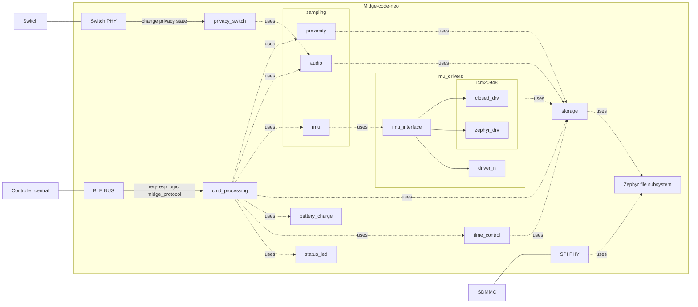
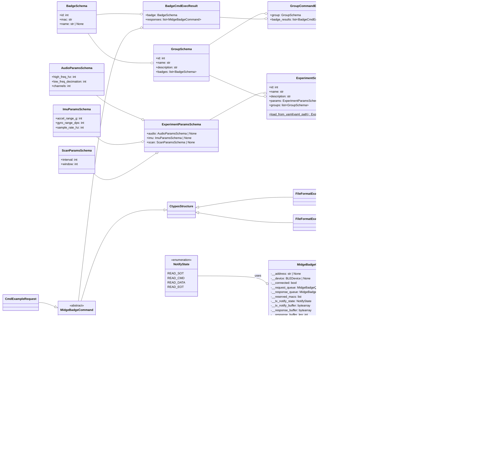

# Firmware

```mermaid
flowchart LR
	subgraph midge_code_neo[Midge-code-neo]
		spi[SPI PHY]
		sw[Switch PHY]
		nus[BLE NUS]

		subgraph imu_drivers[imu_drivers]
			imu_interface[imu_interface]
			subgraph icm20948[icm20948]
				closed_drv[closed_drv]
				zephyr_drv[zephyr_drv]
			end
			driver_n[driver_n]
		end

		subgraph sampling[sampling]
			proximity[proximity]
			audio[audio]
			imu[imu]
		end

		battery_charge[battery_charge]
		status_led[status_led]
		time_control[time_control]
		privacy_switch[privacy_switch]
		mcp[cmd_processing]
		storage[storage]
		fatfs[Zephyr file subsystem]
	end

	nus -->|req-resp logic midge_protocol| mcp
	sw -->|change privacy state| privacy_switch
	privacy_switch -.->|uses| audio

	storage -.->|uses| fatfs
	spi -.->|uses| fatfs

	mcp -.->|uses| proximity
	mcp -.->|uses| audio
	mcp -.->|uses| imu
	mcp -.->|uses| storage
	mcp -.->|uses| battery_charge
	mcp -.->|uses| time_control

	audio -.->|uses| storage
	proximity -.->|uses| storage

	imu -.->|uses| imu_interface
	imu_interface --> closed_drv
	imu_interface --> zephyr_drv
	imu_interface --> driver_n
	imu_drivers -.->|uses| storage

	time_control -.->|uses| storage
	mcp -.->|uses| status_led

	sdmmc[SDMMC]
	controller_central[Controller central]
	switch_node[Switch]

	sdmmc --- spi
	controller_central --- nus
	switch_node --- sw
```

# Control Software

```mermaid
classDiagram
    direction RL

    class MidgeBadgeHub {
        -_experiment: ExperimentSchema
        -_selected_badge: BadgeSchema | None
        -_selected_group: GroupSchema | None
        -_status_check_repeat: bool
        -_sample_id_counter: int
        -_battery_max_voltage_mv: int
        +init_experiment() list~GroupCommandExecResult~
        +execute_cmds(cmds, filter) list~GroupCommandExecResult~
        +execute_cmd(cmd, filter) list~GroupCommandExecResult~
        +get_status() list~GroupCommandExecResult~
        +start_mic() list~GroupCommandExecResult~
        +stop_mic() list~GroupCommandExecResult~
        +start_imu() list~GroupCommandExecResult~
        +stop_imu() list~GroupCommandExecResult~
        +start_scan() list~GroupCommandExecResult~
        +stop_scan() list~GroupCommandExecResult~
        +start_all_sensors() list~GroupCommandExecResult~
        +stop_all_sensors() list~GroupCommandExecResult~
        +get_fw_version() list~GroupCommandExecResult~
        +sd_card_get_free_space() list~GroupCommandExecResult~
        +sd_card_erase() list~GroupCommandExecResult~
        +sd_card_list_files(log_list) list~str~
        +sd_card_erase_file(file_name) list~GroupCommandExecResult~
        +sd_card_erase_folder(folder_name) list~GroupCommandExecResult~
        +get_selected_badge() BadgeSchema
        +get_schema() ExperimentSchema
        +select_badge_by_name(name) bool
        +select_badge_by_mac(mac) bool
        +unselect_badge() void
    }

    class CommandEntry {
        +cmd: MidgeBadgeCommand
        +preprocess_func: Callable
    }

    class BadgeCmdExecResult {
        +badge: BadgeSchema
        +responses: list~MidgeBadgeCommand~
    }

    class GroupCommandExecResult {
        +group: GroupSchema
        +badge_results: list~BadgeCmdExecResult~
    }

    class NotifyState {
        <<enumeration>>
        READ_SOT
        READ_CMD
        READ_DATA
        READ_EOT
    }

    class MidgeBadgeClient {
        -__address: str | None
        -__device: BLEDevice | None
        -__connected: bool
        -__request_queue: MidgeBadgeQueue | None
        -__response_queue: MidgeBadgeQueue | None
        -__reserved_macs: list
        -__tx_notify_state: NotifyState
        -__tx_notify_buffer: bytearray
        -__response_buffer: bytearray
        -__response_buffer_len: int
        -__response_buffer_idx: int
        -__loop: asyncio.AbstractEventLoop
        -__cmd: MidgeBadgeCommand | None
        +get_address() str
        +get_connected() bool
        +start() Future~void~
        +stop() void
        +send_command(request) void
        +get_response(timeout) MidgeBadgeCommand
        +execute_command_log_resp(request) void
        +list_files(log_list) list~str~
        +download_file(path, outfile) void
    }

    class MidgeBadgeQueue {
        +async_loop: asyncio.AbstractEventLoop
        +put_sync(item) void
        +get_sync(timeout) object
    }

    class MidgeBadgeCommand {
        <<abstract>>
        +id() int
    }

    class CmdExampleRequest
    class CmdExampleResponse
    class FileFormatExample1
    class FileFormatExample2

    class ExperimentSchema {
        +id: int
        +name: str
        +description: str
        +params: ExperimentParamsSchema
        +groups: list~GroupSchema~
        +load_from_yaml(yaml_path)$ ExperimentSchema
    }

    class ExperimentParamsSchema {
        +audio: AudioParamsSchema | None
        +imu: ImuParamsSchema | None
        +scan: ScanParamsSchema | None
    }

    class AudioParamsSchema {
        +high_freq_hz: int
        +low_freq_decimation: int
        +channels: int
    }

    class ImuParamsSchema {
        +accel_range_g: int
        +gyro_range_dps: int
        +sample_rate_hz: int
    }

    class ScanParamsSchema {
        +interval: int
        +window: int
    }

    class GroupSchema {
        +id: int
        +name: str
        +description: str
        +badges: list~BadgeSchema~
    }

    class BadgeSchema {
        +id: int
        +mac: str
        +name: str | None
    }

    class CtypesStructure
    class AsyncioQueue
    class BleakClient

    CtypesStructure <|-- MidgeBadgeCommand
    AsyncioQueue <|-- MidgeBadgeQueue
    FileFormatExample1 --|> CtypesStructure
    FileFormatExample2 --|> CtypesStructure
    MidgeBadgeCommand <|-- CmdExampleRequest
    MidgeBadgeCommand <|-- CmdExampleResponse

    MidgeBadgeClient o-- NotifyState : uses
    MidgeBadgeClient o-- MidgeBadgeQueue : uses
    MidgeBadgeClient -- BleakClient : wraps

    CommandEntry --> MidgeBadgeCommand
    BadgeCmdExecResult o-- BadgeSchema
    BadgeCmdExecResult o-- MidgeBadgeCommand
    GroupCommandExecResult o-- GroupSchema
    GroupCommandExecResult o-- BadgeCmdExecResult

    ExperimentSchema o-- ExperimentParamsSchema
    ExperimentParamsSchema o-- AudioParamsSchema
    ExperimentParamsSchema o-- ImuParamsSchema
    ExperimentParamsSchema o-- ScanParamsSchema
    ExperimentSchema o-- GroupSchema
    GroupSchema o-- BadgeSchema

    MidgeBadgeHub --> ExperimentSchema : uses
    MidgeBadgeHub --> MidgeBadgeClient : controls
    MidgeBadgeHub --> CommandEntry : processes

    note for MidgeBadgeCommand "Implementor classes omitted,\nCmdExampleRequest & CmdExampleResponse\nare placeholders."
```
