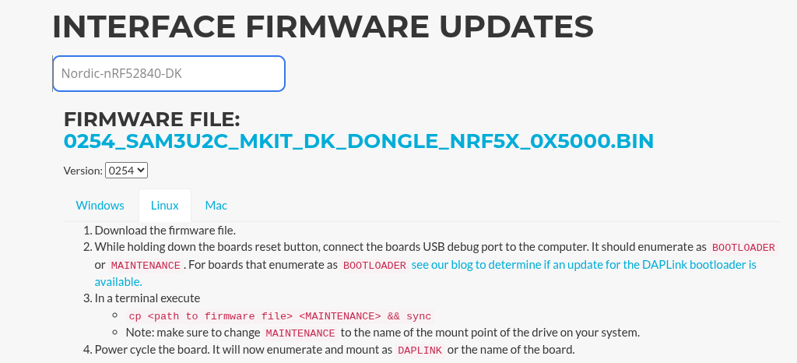
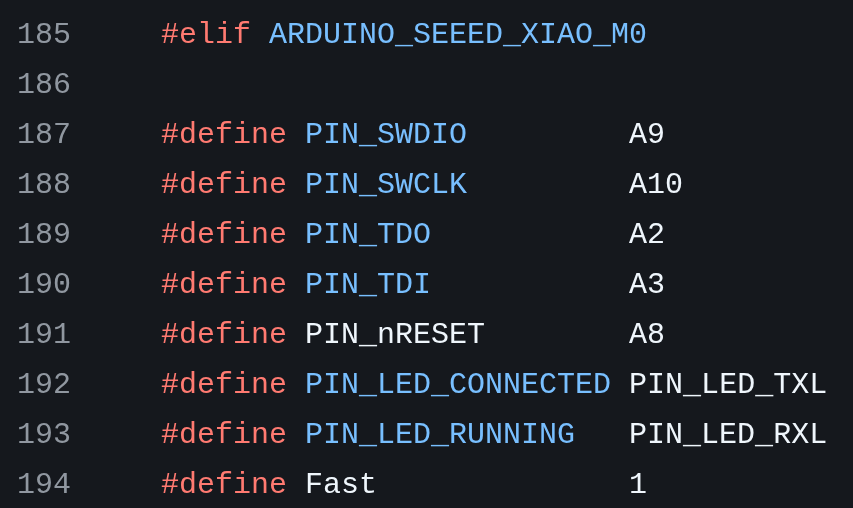

# DAP-Link | CMSIS-DAP

This is an easy way to create debug probes from ARM Cortex-M
micro-controllers laying around. Usually, no special circuitry is required,
although this can depend on the specific firmware.

Some main characteristics to take into account from this type of probe:

- It might not be as fast as specialized probes like a JLink
- Some implementations do not use `VTREF`. Only `GND`, `SWDIO` and `SWCLK` are
  required to establish the connection.

Some known options of platforms that can be used to create a DAPLink

- [Official List](https://daplink.io/): Search for your board and you will be
  provided the download link+flashing instructions, e.g.:

    

- [Xiao M0 and other Seeed Studio boards](#creating-a-dap-link-from-a-seeed-studio-board): Setup guide below.


    

## Creating a DAP-Link from a Seeed Studio board

Seeed Studio boards are attractive for this usage as some of their platforms are
quite cheap, like the [Xiao M0](https://www.digikey.nl/nl/products/detail/seeed-technology-co-ltd/102010328/11506471), and sometimes they are stocked by
your local hobby electronics shop.

Seed provides a [detailed guide on creating a DAP-Link](https://wiki.seeedstudio.com/Arduino-DAPLink) for many of their platforms, although in the case of a
Xiao M0 it can be abbreviated, just:

1. Download the `.uf2` pre-compiled image: <http://files.seeedstudio.com/wiki/Seeeduino-XIAO/res/simple_daplink_xiao.uf2>
1. Connect the Xiao M0 via USB to your PC.
1. Short the pads at the side of the USB port to
   [enter bootloader mode](https://wiki.seeedstudio.com/Seeeduino-XIAO/#enter-bootloader-mode)

    

1. An external drive will show up as newly connected. Drag and drop the `.uf2`
   file to the drive and wait for the copy to end.
1. Once the copy is finished, disconnect the Xiao M0 from your PC and connect
   again

> The Xiao M0 implementation does **NOT** use `VTREF`, **DO NOT CONNECT 3V3 or 5V** to the debug port

For reference, the pinout of the Xiao M0 DAP-Link is the [following](https://github.com/Seeed-Studio/Seeed_Arduino_DAPLink/blob/master/src/DAP_config.h#L185-L194)



## Usage

The basic rule debugging software uses to identify if a DAP-Link is available,
is to search for a USB device with`CMSIS-DAP` in their name. We can do the same
to verify our DAP-Link is actually alive.

### Verify it's there

```
$ lsusb
```

### Verify it can control a target

In the case of the Mingle Midge V1 and V2, follow the
[wiring guide via SWD](../wiring.md): and execute the following

```Shell
openocd -f interface/cmsis-dap.cfg -f target/nrf52.cfg
```
