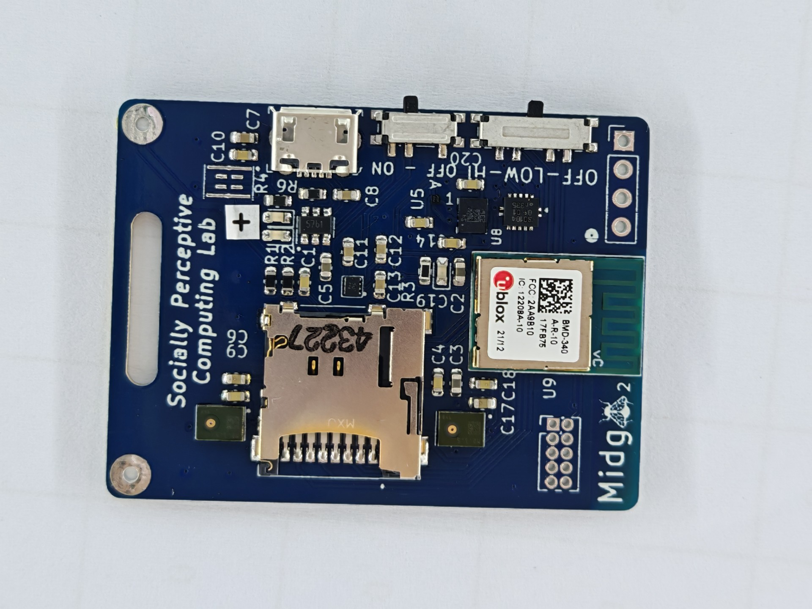

# Setup connection for Flashing/Debugging

[TL;DR](#connection-steps)

## Via SWD / JTAG

**TURN OFF THE DEVICE TO BE CONNECTED TO BEFORE STARTING**

Mingle Midge devices developed so far have a 2x5 0.05''-pitch SWD port for
flashing and debugging. The port is usually in the form of exposed THT pads,
although some devices may have a
[SWD header](https://www.adafruit.com/product/4048?srsltid=AfmBOopCCZ2QCuUxpTjI_mmOHBpfGjBLg2uELmRDrqa7FHkcYZhxE3ml)
already soldered. In the next image, the bottom-right part shows the exposed
2x5 terminal.

> If you are not familiar with this port, you just need to know that it allows
  you to control the CPU and memory of the devices that provide it, that is why
  is used for flashing firmware, single stepping the core, and printing logs.

The pinout of the port is based on the
[ARM CoreSight 10 connector](https://developer.arm.com/documentation/101761/1-0/Target-interface-connectors/CoreSight-10-connector)
but:

- `KEY` is connected to `GND` **(deviation from the specification of the connector, should be `NC`)**
- `TDO/SWO`, `TDI`, `nSRST` are `NC`

In essence, only the pins required for SWD are provided.

### Regarding VCC/VTREF

The CoreSight 10 pin connector explicitly documents the top-left pin as `VTREF`
a **pin that measures the `HIGH` voltage of the debug target**
but some manufacturers and bloggers have taken their liberties when creating
images for their documentation, for example, this one from
Microchip:

So _which is it huh?_

The answer is that **from the perspective of the device**, if the logic `HIGH`
is the same as `VCC`, `VCC` is valid as a way to measure `VTREF`, so it can be
wired to the pad.
**From the perspective of the probe**, if the probe supports measuring `VTREF`,
then you can connect the provided pin for that, but **NOT** `VCC` or pins that
work as power sources (like `3V3`). You are **NOT** supposed to power a platform
using the debug probe.

> Hey but I have worked on a board before where I used VCC from the probe to
  power the device and it worked fine! Is this really a problem?

> R/ Yes! This usage can work if the power supply of the board accounts for it,
  but it is not assured. In the case of V1 and V2 Mingle Midge devices, this non-standard use is not supported and could damage the power supply.

### Setting up the Probes

Guides are provided for setting up the following probes:

- [CMSIS-DAP](probes/daplink.md) (cost-effective DIY-probe)

- [SEGGER J-LINK EDU](probes/jlink-edu-mini.md)

### Components to connect to the port

#### No SWD socket on board (Common case)

You will need the following:

- A pogo 2x5 0.05'' pitch pin clip (We recommend [this one](https://www.adafruit.com/product/5434) from adafruit).

  

  > BEWARE: The adafruit pogo clip inverts the pin row orientation,
    pay attention to `A` and `B` labels.

- If you are using a debug probe with a SWD cable as output, you will need an
  adapter breakout board to get 0.1'' pitch pins: <https://www.adafruit.com/product/2743>

  

- 4 jumper wires, type depending on your debug probe/adapter. These you can get
  online in stores like Adafruit or any other hobby electronics shop around.
  Chances are that if you are near an university, there should be a place
  close by. You are looking for something like this:

  

#### With SWD socket pre-soldered

Depending on the probe you are using, you might need some adapters. If your
probe provides:

- Standard 0.1'' pitch pins (e.g. Xiao M0 DAPLink): SWD breakout <https://www.adafruit.com/product/2743>, and a cable <https://www.adafruit.com/product/1675>.

- Full 2x10 0.1'' pitch pin JTAG port: You can use something like this: <https://www.adafruit.com/product/2094> and buy a 2x5 SWD cable <https://www.adafruit.com/product/1675>

- SWD cable (e.g. Segger JLink-EDU mini): Nothing!

### Connection Steps

Assuming you already have all the required components:

1. Disconnect the charging cable from the Mingle Midge if connected.
1. Switch OFF the Mingle Midge if it was ON.
1. Disconnect the debug probe from your laptop.
1. If using a probe with SWD cable output, connect to the SWD breakout board.
1. Using the jumpers, connect the probe to the pogo clip. Be mindful about the
   SWD pinout.
1. Clip the Mingle Midge SWD port
1. Connect the debug probe to your laptop
1. Turn on the Mingle Midge

Now you are set for flashing and debugging!. Want to test the connection?
Each probe setup guide provides at the end a how-to.

## Via BLE OTA - Over The Air (Only flashing)

Not supported at the moment. Planned support via MCUmgr in the future.

To read more on MCUmgr: <https://docs.zephyrproject.org/latest/services/device_mgmt/mcumgr.html>
