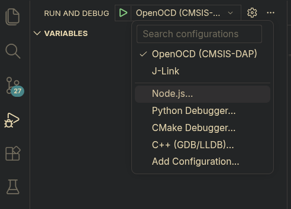
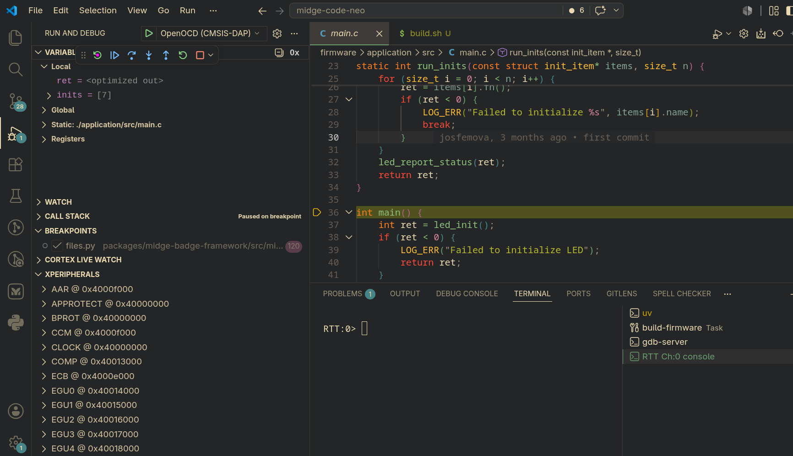

# About

This is the reason why `.vscode` is not `.gitignore`'d. This is essentially a
way of working with the code that revolves around the usage of the
`Cortex-Debug` extension, which allows using the integrated debug
functionalities of VSCode for Cortex-M based devices (like the
micro-controllers in Mingle Midge devices)

# Setup

1. [Setup Zephyr RTOS](setup-zephyr.md)
1. Open VSCode
1. Install Cortex-Debug extension: <https://marketplace.visualstudio.com/items?itemName=marus25.cortex-debug>
1. Close VSCode

After this, for work sessions just invoke vscode via the wrapper script:

1. Launch VSCode:

    ```Shell
    ./launch_code.sh # from midge-code-neo root
    ```

# Just building

1. `Ctrl+Shift+P`->`Tasks: Run Task`->Enter->`build-firmware`

# Just flashing

1. `Ctrl+Shift+P`->`Tasks: Run Task`->Enter->`flash-firmware`

# Debugging

1. Open the VSCode Debug Menu and select the appropiate launch config based on
   the debug probe you have.


    

1. Click on the green arrow button to launch the application. The launch process
   will ask for selecting the Mingle Midge version you are working with.
1. The application will be flashed and `Cortex-Debug` will automatically
   add a breakpoint on `main`
1. On the debug menu, you will be able to see variables, call stack, peripheral
   memory (formatted using an svd), etc.
1. On the focus terminal, you will have 2 terminals created, one called
   `gdb-server` and another one for the RTT output


After the previous steps, you should be looking at something like this:



